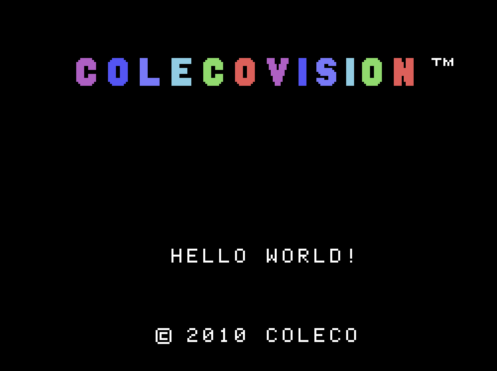
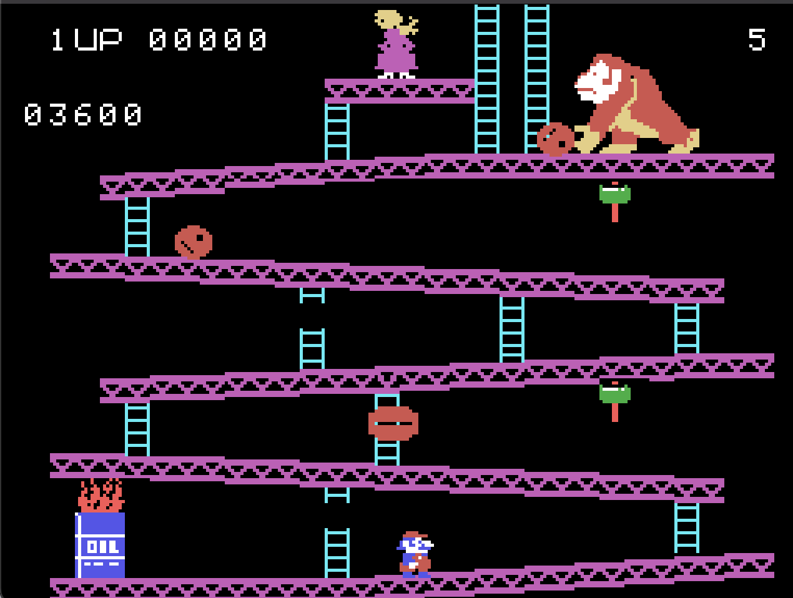
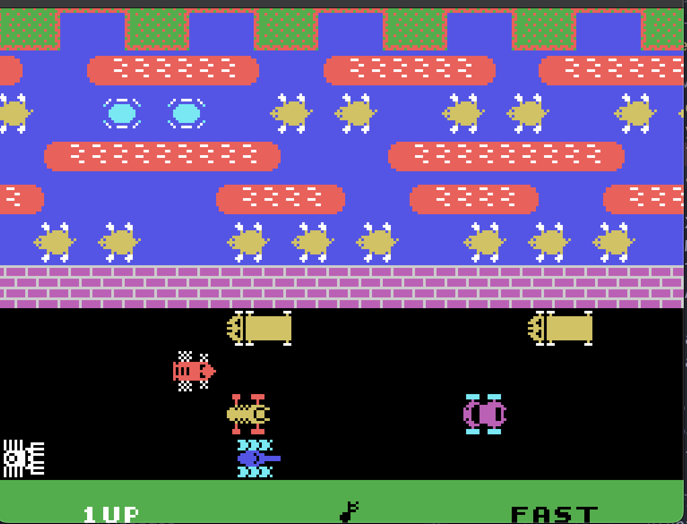
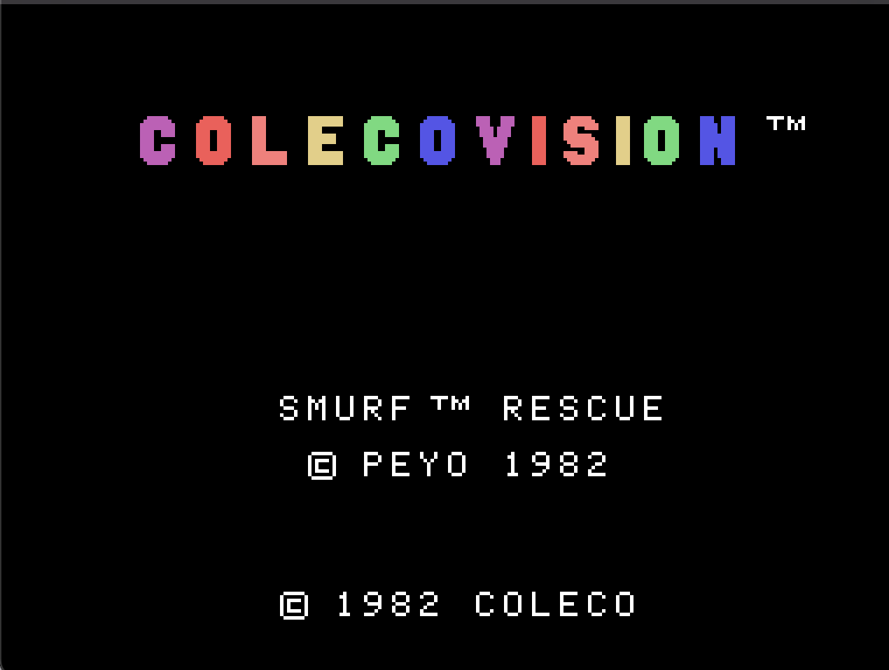
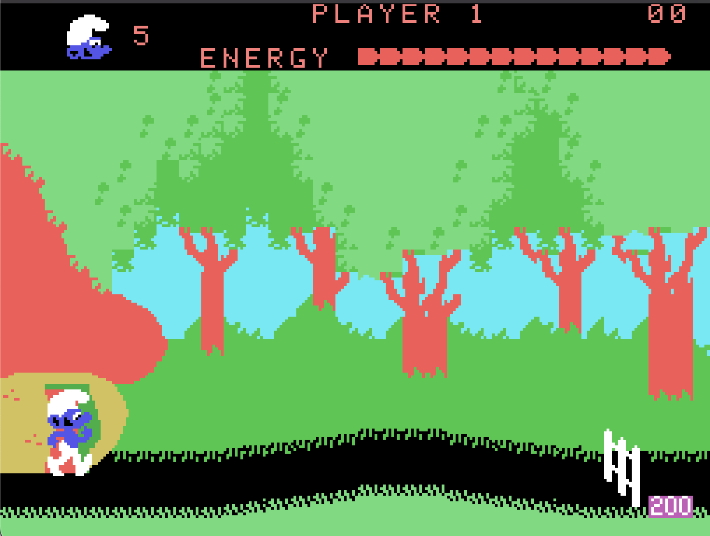

## zoleco

The [ColecoVision](https://en.wikipedia.org/wiki/ColecoVision) was a 2nd-generation video game console from the early 80s. This is a full emulator of that system, capable of running ROMs for that console.





See [demos](#demos) for more.

## Usage

You need Zig and SDL2 to run this project.

```bash
# macos
brew install sdl2 zig
```

Then build and run:

```bash
zig build
./zig-out/bin/zoleco <path to rom>
```

Most ROMs are easily found online. I don't know the full legality but this stuff is so old I doubt anyone cares.

I've only tested this on MacOS but the dependencies are platform agnostic so it might work on yours. If it does, let me know in an Issue!

### Keybindings

The emulator supports two controllers with the following default keybindings:

#### Controller 1

- Movement: Arrow keys
- Left Action Button: A
- Right Action Button: S
- Blue Button: D
- Purple Button: F
- Keypad: Number keys 0-9
- Asterisk: Period (.)
- Hash: Right Slash

#### Controller 2

- Movement: IJKL (I=up, J=left, K=down, L=right)
- Left Action Button: G
- Right Action Button: H
- Blue Button: J
- Purple Button: K
- Keypad: Z,X,C,V,B,N,M,<,>
- Asterisk: Forward Slash (/)
- Hash: Right Shift

Press ESC to quit the emulator.

### Limitations

The emulator currently only supports standard ColecoVision ROMs. Super Game Module (SGM) capabilities and other hardware expansions are not currently supported.

## Development

This project has three main components emulator components:

- Z80 CPU
- TMS9918 video
- SNG76489 sound chip

Most of the remaining code is ties the components together to drive them with cycle accuracy, provide interrupt handling, handle input, and draw the framebuffer to the screen.

I developed the individual components in isolation. There are isolated example programs for each one:

- `examples/vgm_player`: Read a VGM file for the SN76489 sound chip and play it.
- `examples/z80_tester.zig`: Execute the exhaustive [Z80 test suite for JSMoo](https://github.com/SingleStepTests/z80). Each opcode has 1000 test cases. Run with `zig build cputest`.
- `examples/tms9918_viewer`: Displays an image file using a TMS9918 emulator. Not actually used.

The `tms9918_viewer` example video code is not actually used in the emulator because I couldn't figure out how to integrate it. Instead, I ported the video emulator code from Gearcoleco. Maybe one day I'll try integrating [TMS9918](./examples/tms9918_viewer/TMS9918.zig) properly. The overall application setup and emulation loop is also taken from Gearcoleco.

## Demos



<video src="https://github.com/user-attachments/assets/adb5636a-f38f-401b-bd7f-ae807c5382e8" controls="controls" style="max-width: 730px;">
</video>
